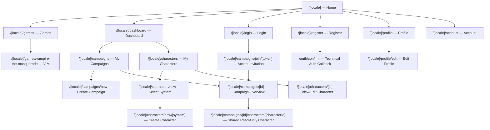
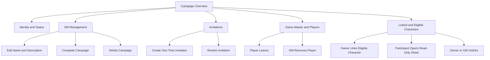
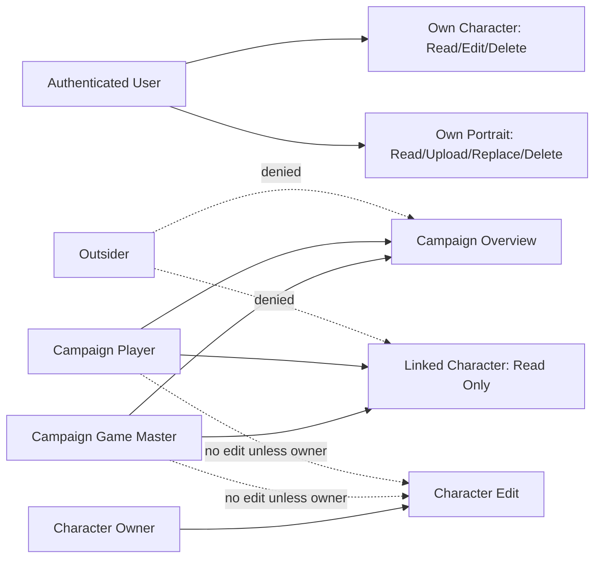
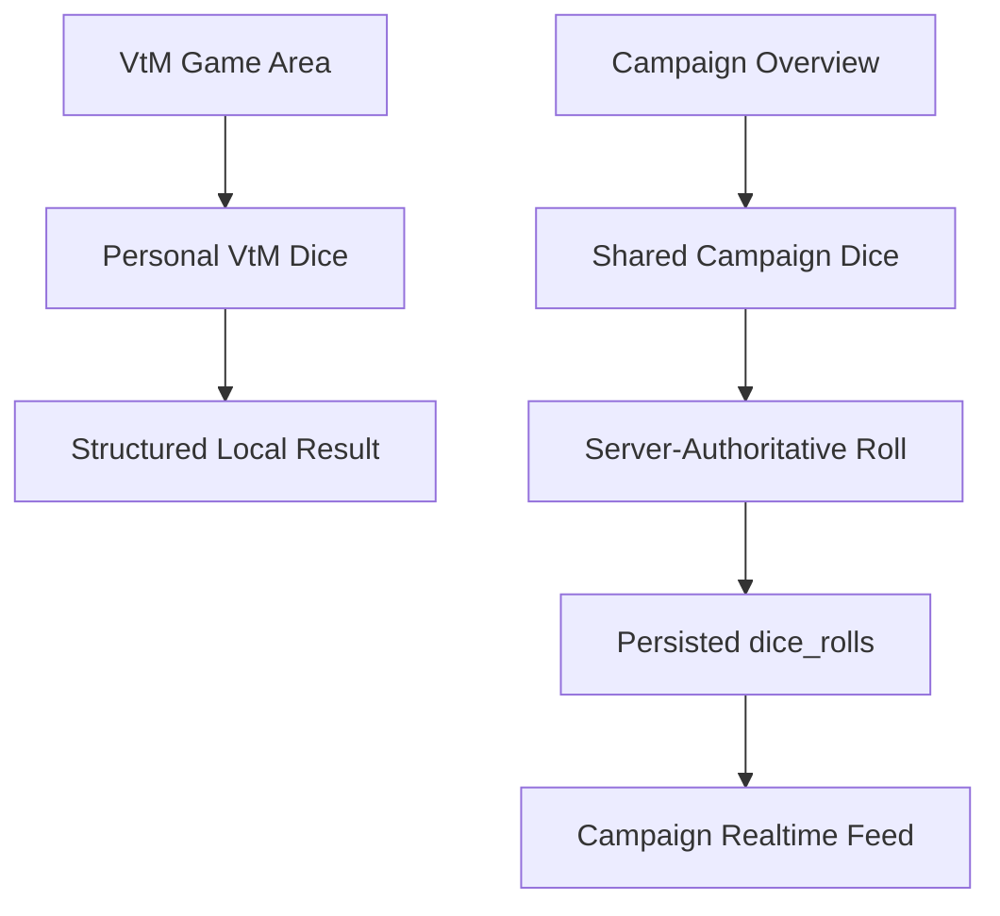
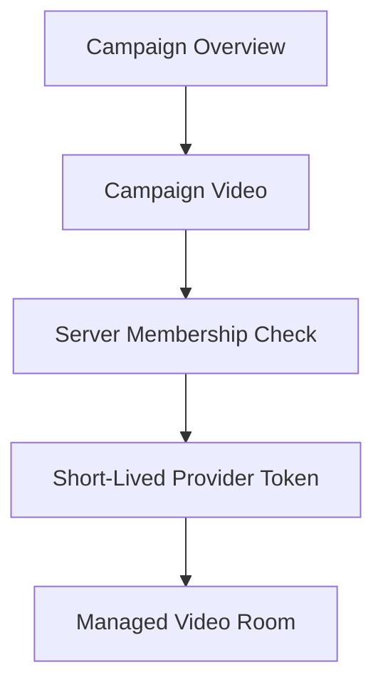
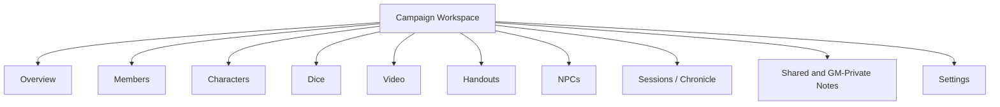

# Site Map

## Status

This document contains:

1. the implemented site map at `main` commit `a1c3a61381a2b7cddab9dd8fb620af56342209a9`;
2. the next-stage map for VtM dice and video;
3. the later campaign-workspace direction.

The longer-term planning reference remains `SITE_MAP_TARGET.md`.

## 1. Current implemented site map



## 2. Current campaign overview structure

The current Campaign Foundation uses one integrated overview route rather than separate subroutes for every section.



## 3. Current access map



## 4. Next-stage VtM dice map

Recommended personal route:

```text
/[locale]/games/vampire-the-masquerade/tools/dice
```

Recommended shared campaign route:

```text
/[locale]/campaigns/[id]/dice
```



Personal dice should be implemented first without persistence.

The same deterministic VtM evaluator should later be reused by the server-authoritative campaign roll path.

## 5. Video map after the dice phases

Recommended campaign route:

```text
/[locale]/campaigns/[id]/video
```



There should be no permanent public room link.

ADR-009 remains Proposed until a provider comparison and disposable spike are complete.

## 6. Later Friend Campaign Alpha map



Only implemented areas should appear as active navigation.

## 7. Current versus planned

Implemented now:

- Home;
- Games and basic VtM page;
- Auth;
- Dashboard;
- Profile and Account;
- Characters;
- Campaigns;
- invitation acceptance;
- membership controls;
- character sharing;
- campaign management.

Planned next:

- personal VtM dice;
- shared campaign dice;
- realtime campaign dice feed;
- campaign video.

Planned later:

- handouts;
- NPCs;
- sessions;
- notes;
- full VtM Game Hub;
- Public Readiness;
- Call of Cthulhu 7e.
