# TTRPG Hub — Current and Target Site Maps

        > Editable schematic site maps in Mermaid and plain-text tree formats.
        > The target map reflects the approved terminology and structural decisions.

        ## 1. Current Site Map

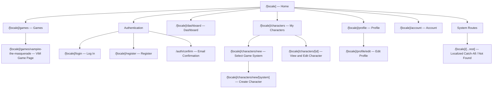

### Current structure summary

```text
/[locale]
├── games
│   └── vampire-the-masquerade
├── login
├── register
├── dashboard
├── characters
│   ├── new
│   │   └── [system]
│   └── [id]
├── profile
│   └── edit
├── account
└── [...rest]

/auth
└── confirm
```

### Current access model

| Area | Current access |
|---|---|
| Home | Public |
| Games | Public |
| VtM game page | Public |
| Log in and Register | Public |
| Dashboard | Authenticated user |
| Profile and Account | Authenticated user |
| Character list | Character owner |
| Character detail | Character owner |
| Character portraits | Character owner through private Storage and signed URLs |

### Current scope

Implemented:

- bilingual locale-prefixed routes;
- authentication and user profiles;
- owner-only character management;
- complete VtM V5 character sheet;
- private portraits;
- responsive desktop, tablet, and mobile layouts.

Not implemented:

- campaigns;
- campaign memberships and invitations;
- shared dice rolls;
- video rooms;
- handouts;
- NPCs;
- sessions;
- campaign notes;
- Call of Cthulhu 7e tools;
- public-ready account, legal, and support pages.

---

        ---

        ## 2. Revised Target Site Map

> Editable schematic site map in Mermaid and plain-text tree formats.
> The diagrams can be edited directly in Markdown and rendered by GitHub and other Mermaid-compatible tools.

---

## 1. Access Model

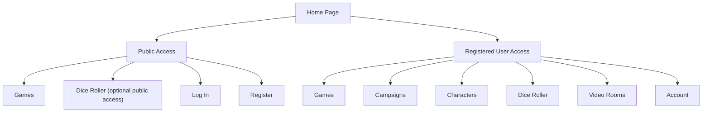

### Access rule

- Unregistered users can access **Games** and, if approved, the standalone **Dice Roller**.
- Registered users can also access **Campaigns**, **Characters**, **Video Rooms**, and **Account**.
- Campaign-specific video and dice tools are available inside the campaign **Game Room**.

---

## 2. Top-Level Site Map

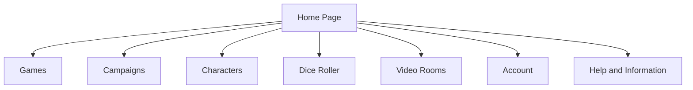

---

## 3. Games Section

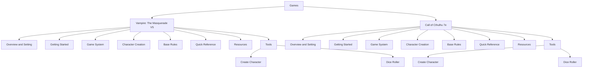

### Notes

- **Vampire: The Masquerade V5** is the first complete game section.
- **Call of Cthulhu 7e** follows the same target structure but remains a later milestone.
- Game pages contain general information and system-specific tools.
- Private campaign data does not belong inside the Games section.

---

## 4. Campaigns Section

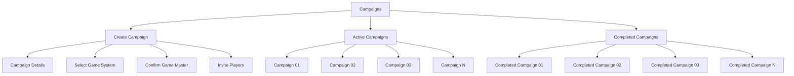

### Campaign creation

Player invitations are sent during campaign creation. There is no separate global Campaign Invitations section in the initial structure.

---

## 5. Active Campaign Structure

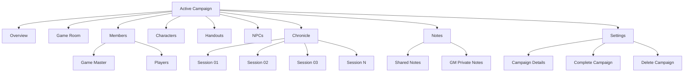

### Active campaign overview

The campaign Overview may show:

- campaign name and description;
- game system;
- Game Master;
- players;
- next or current session;
- active characters;
- recent Chronicle entries;
- quick entry to the Game Room.

---

## 6. Game Room

The **Game Room** is the virtual table for the current session.

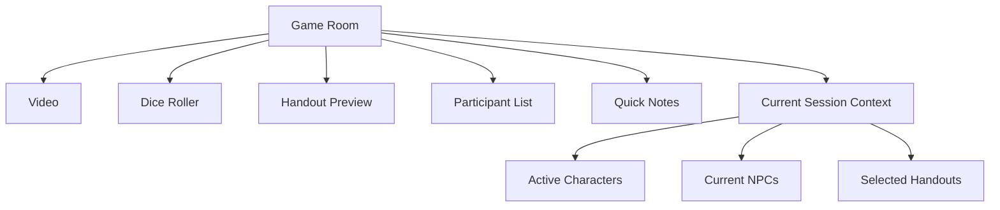

### Game Room principle

The Game Room combines the live-session tools in one place:

- video communication;
- campaign dice roller;
- handout preview;
- participant list;
- current characters and NPCs;
- temporary quick notes.

Permanent campaign content remains stored in:

- Characters;
- Handouts;
- NPCs;
- Chronicle;
- Notes.

---

## 7. Completed Campaign Structure

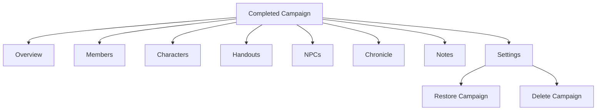

### Completed campaign behavior

- Completed campaigns are primarily read-only archives.
- The Game Room is not active.
- The GM may restore a campaign if the project supports reopening completed campaigns.

---

## 8. Characters Section

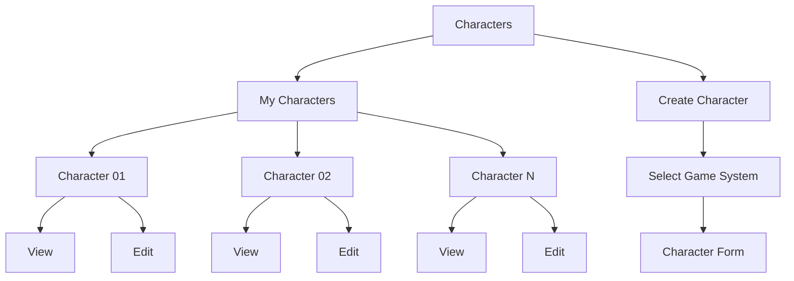

### Character principle

- View and Edit are contained inside **My Characters**.
- There is no separate Character Details or Character Settings section.
- Campaign assignment and other character changes are handled through the existing character editing flow when those functions are introduced.

---

## 9. Standalone Dice Roller

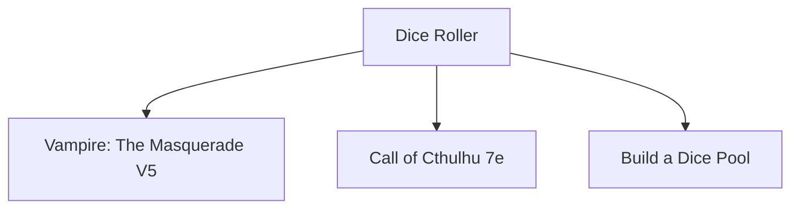

### Dice Roller distinction

- The standalone Dice Roller is a general tool outside a campaign.
- The Game Room contains the campaign/session Dice Roller.
- Both may reuse the same game-system dice engine.

---

## 10. Video Rooms

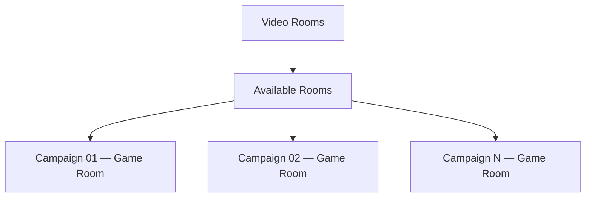

### Video Rooms principle

The top-level Video Rooms section is a shortcut to Game Rooms that the registered user can currently access. The actual video room belongs to a campaign Game Room.

---

## 11. Account Section

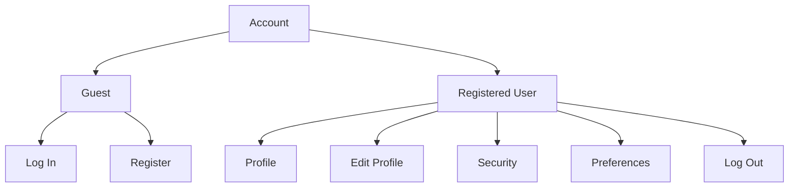

Potential public-readiness additions:

- Privacy;
- Export Data;
- Delete Account.

---

## 12. Help and Information

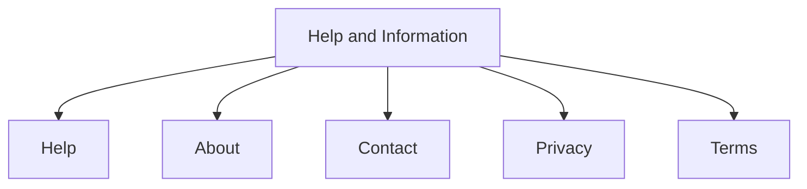

These pages may be introduced during the Public Readiness milestone.

---

## 13. Complete Plain-Text Target Tree

```text
Home Page
├── Games
│   ├── Vampire: The Masquerade V5
│   │   ├── Overview and Setting
│   │   ├── Getting Started
│   │   ├── Game System
│   │   ├── Character Creation
│   │   ├── Base Rules
│   │   ├── Quick Reference
│   │   ├── Resources
│   │   └── Tools
│   │       ├── Create Character
│   │       └── Dice Roller
│   └── Call of Cthulhu 7e
│       ├── Overview and Setting
│       ├── Getting Started
│       ├── Game System
│       ├── Character Creation
│       ├── Base Rules
│       ├── Quick Reference
│       ├── Resources
│       └── Tools
│           ├── Create Character
│           └── Dice Roller
├── Campaigns
│   ├── Create Campaign
│   │   ├── Campaign Details
│   │   ├── Select Game System
│   │   ├── Confirm Game Master
│   │   └── Invite Players
│   ├── Active Campaigns
│   │   └── Campaign
│   │       ├── Overview
│   │       ├── Game Room
│   │       │   ├── Video
│   │       │   ├── Dice Roller
│   │       │   ├── Handout Preview
│   │       │   ├── Participant List
│   │       │   ├── Quick Notes
│   │       │   └── Current Session Context
│   │       ├── Members
│   │       │   ├── Game Master
│   │       │   └── Players
│   │       ├── Characters
│   │       ├── Handouts
│   │       ├── NPCs
│   │       ├── Chronicle
│   │       │   └── Sessions
│   │       ├── Notes
│   │       │   ├── Shared Notes
│   │       │   └── GM Private Notes
│   │       └── Settings
│   │           ├── Campaign Details
│   │           ├── Complete Campaign
│   │           └── Delete Campaign
│   └── Completed Campaigns
│       └── Completed Campaign
│           ├── Overview
│           ├── Members
│           ├── Characters
│           ├── Handouts
│           ├── NPCs
│           ├── Chronicle
│           ├── Notes
│           └── Settings
│               ├── Restore Campaign
│               └── Delete Campaign
├── Characters
│   ├── My Characters
│   │   └── Character
│   │       ├── View
│   │       └── Edit
│   └── Create Character
│       ├── Select Game System
│       └── Character Form
├── Dice Roller
│   ├── Vampire: The Masquerade V5
│   ├── Call of Cthulhu 7e
│   └── Build a Dice Pool
├── Video Rooms
│   └── Available Game Rooms
├── Account
│   ├── Guest
│   │   ├── Log In
│   │   └── Register
│   └── Registered User
│       ├── Profile
│       ├── Edit Profile
│       ├── Security
│       ├── Preferences
│       └── Log Out
└── Help and Information
    ├── Help
    ├── About
    ├── Contact
    ├── Privacy
    └── Terms
```

---

## 14. Naming Applied

| Previous label | Revised label |
|---|---|
| Dice Pull | Dice Roller |
| Build Your Own Set | Build a Dice Pool |
| Legacy | Completed Campaigns |
| History | Chronicle |
| Useful sources | Resources |
| Lore Description | Overview and Setting |
| Playground | Game Room |

---

## 15. Editing Notes

- The diagram intentionally does not include a Dashboard.
- Player invitations are part of Create Campaign.
- Members contain only Game Master and Players.
- Campaign dice and video are inside the Game Room.
- View and Edit are inside My Characters.
- Character Settings is not included.
- Unregistered users see only Games, Account authentication actions, and optionally the standalone Dice Roller.
- The top-level Video Rooms section is only a shortcut to available campaign Game Rooms.
