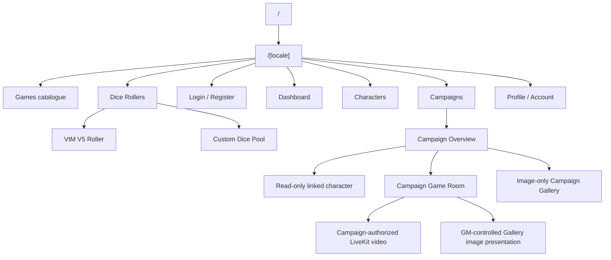
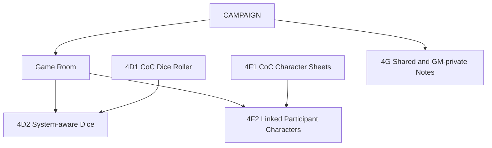

# Site Map

## Status

This document separates the current implemented route map from approved forward product areas. Planned labels are not routes until implementation exists.

## Current implemented site map

```mermaid
flowchart TD
    ROOT["/"] --> LOCALE["/[locale]"]
    LOCALE --> GAMES["Games catalogue"]
    LOCALE --> DICE["Dice Rollers"]
    LOCALE --> AUTH["Login / Register"]
    LOCALE --> DASHBOARD["Dashboard"]
    LOCALE --> CHARACTERS["Characters"]
    LOCALE --> CAMPAIGNS["Campaigns"]
    LOCALE --> PROFILE["Profile / Account"]
    DICE --> VTM_DICE["VtM V5 Roller"]
    DICE --> CUSTOM_DICE["Custom Dice Pool"]
    CAMPAIGNS --> CAMPAIGN["Campaign Overview"]
    CAMPAIGN --> SHARED_CHARACTER["Read-only linked character"]
    CAMPAIGN --> GAME_ROOM["Campaign Game Room"]
    CAMPAIGN --> GALLERY["Image-only Campaign Gallery"]
    GAME_ROOM --> VIDEO["Campaign-authorized LiveKit video"]
    GAME_ROOM --> DISPLAY["GM-controlled Gallery image presentation"]
```

The catalogue includes a generic CoC 7e campaign shell. CoC character and dice routes do not yet exist. Delta Green is a catalogue entry only. No complete game-system hub exists.

## Approved Phase 4 additions

```mermaid
flowchart TD
    CAMPAIGN --> GAME_ROOM["Game Room"]
    GAME_ROOM --> SYSTEM_DICE["4D2 System-aware Dice"]
    COC_DICE["4D1 CoC Dice Roller"] --> SYSTEM_DICE
    GAME_ROOM --> LINKED_CHARACTERS["4F2 Linked Participant Characters"]
    COC_CHARACTERS["4F1 CoC Character Sheets"] --> LINKED_CHARACTERS
    CAMPAIGN --> NOTES["4G Shared and GM-private Notes"]
```

Phase 4E refines Campaign and Game Room UX/UI without adding a route or product capability. Unavailable placeholders must remain visibly disabled and must not expose fake routes or behavior.

Campaign Gallery contains four fixed image-only sections: Handouts, NPC, Maps & Plans, and Other. NPC and Maps & Plans are image categories, not structured systems. Phase 4C2 added presentation, not a general document Handouts feature. Notes do not imply Sessions, Chronicle, NPC records, clues, structured maps, or wiki modules.

## Later approved areas

- Phase 5 site-wide UI Technical Refinement adds no product routes;
- Phase 6 Visual Identity adds no product routes by itself;
- Phase 7 implements Delta Green parity using established shared routes and system-specific routes justified at implementation time;
- Phase 8 adds system hubs in CoC, Delta Green, then Vampire order;
- Phase 9 may add public-readiness support routes only after their exact operational need is reviewed.

## Explicit non-routes

Standalone Video Rooms are not active roadmap scope. `/[locale]/video-rooms` and related routes are not approved targets. Global/document Handouts, NPCs, Sessions, Chronicle, recording, transcription, and screen-sharing routes are also not active commitments.

## Current versus planned

| Area | Current | Approved forward state |
|---|---|---|
| Campaign video | Implemented and Production accepted | Retain; technical refinement only unless separately scoped |
| Campaign Gallery | Four-section private image library and Game Room presentation implemented | Retain; Campaign Wallpaper remains uncommitted `IDEA-007` only |
| VtM dice | Personal roller implemented | Use for VtM campaigns in 4D2 |
| CoC dice | Not implemented | 4D1 personal roller, then 4D2 campaign integration |
| VtM characters | Implemented | 4F2 linked-character Game Room integration |
| CoC characters | Not implemented | 4F1 sheets, then 4F2 integration |
| Campaign notes | Not implemented | 4G shared permitted notes and GM-private notes only |
| Game-system hubs | Not implemented | 8A CoC, 8B Delta Green, 8C Vampire |
| Standalone Video Rooms | Not implemented | Uncommitted backlog idea only |
