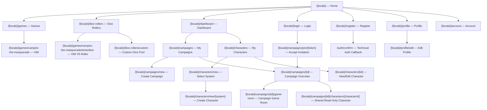
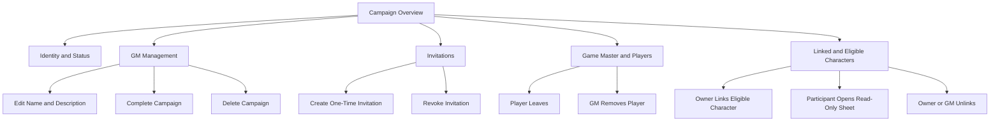
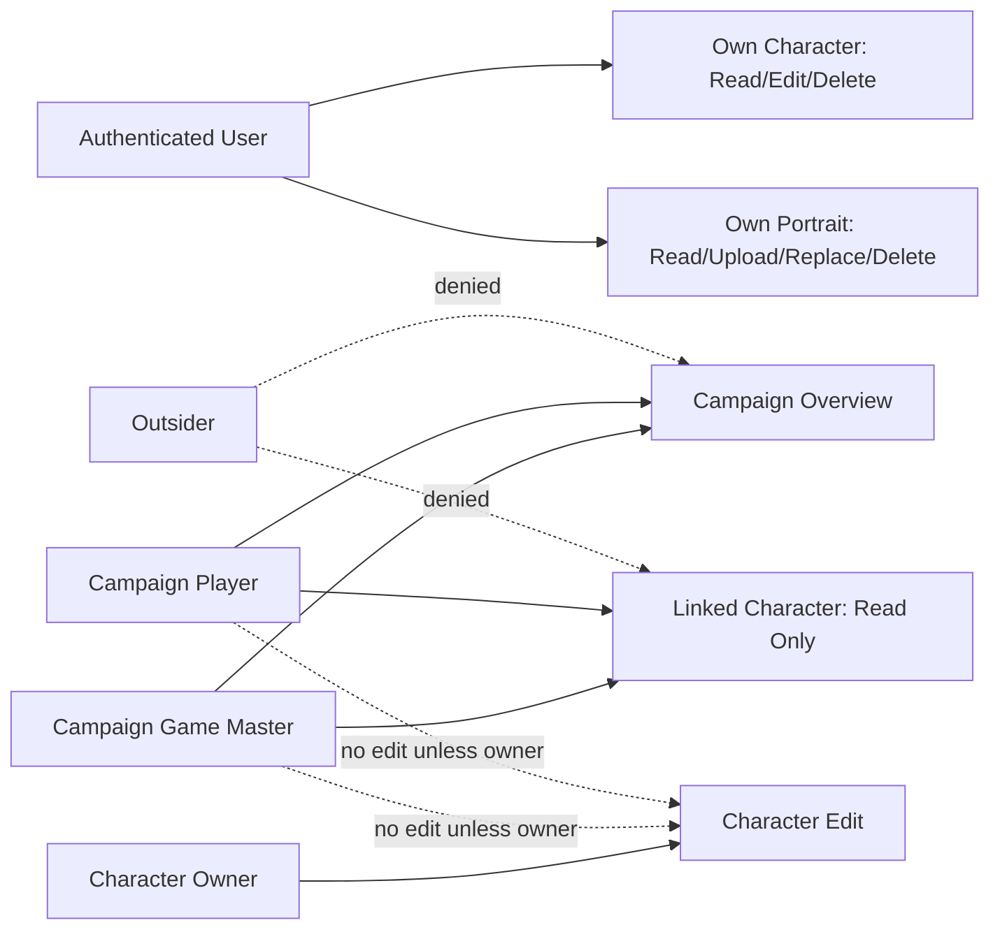
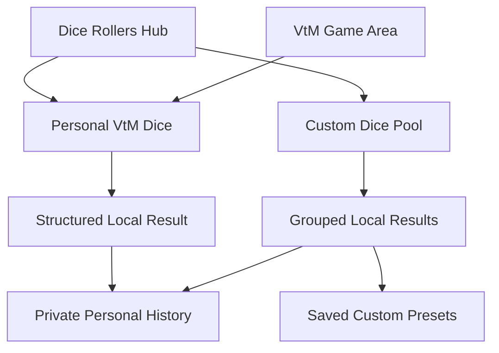
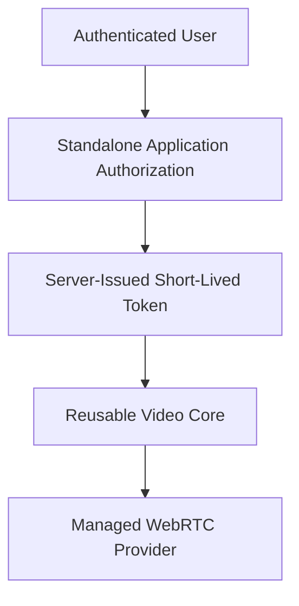
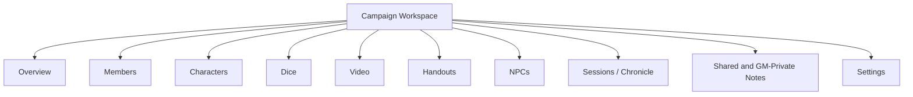

# Site Map

## Status

This document contains:

1. the implemented site map at `main` commit `b033b93b1993561cbdf349987aa37aaf83574108`;
2. the separate planned standalone Video Rooms map;
3. the later campaign-workspace direction.

The longer-term planning reference remains `SITE_MAP_TARGET.md`.

## 1. Current implemented site map


```mermaid
flowchart TD
    ROOT["/[locale] — Home"]

    ROOT --> GAMES["/[locale]/games — Games"]
    GAMES --> VTM["/[locale]/games/vampire-the-masquerade — VtM"]
    ROOT --> DICE_ROLLERS["/[locale]/dice-rollers — Dice Rollers"]
    DICE_ROLLERS --> PERSONAL_DICE["/[locale]/games/vampire-the-masquerade/tools/dice — VtM V5 Roller"]
    DICE_ROLLERS --> CUSTOM_DICE["/[locale]/dice-rollers/custom — Custom Dice Pool"]

    ROOT --> DASHBOARD["/[locale]/dashboard — Dashboard"]
    DASHBOARD --> CAMPAIGNS["/[locale]/campaigns — My Campaigns"]
    DASHBOARD --> CHARACTERS["/[locale]/characters — My Characters"]

    ROOT --> LOGIN["/[locale]/login — Login"]
    ROOT --> REGISTER["/[locale]/register — Register"]
    ROOT --> PROFILE["/[locale]/profile — Profile"]
    PROFILE --> PROFILE_EDIT["/[locale]/profile/edit — Edit Profile"]
    ROOT --> ACCOUNT["/[locale]/account — Account"]

    CHARACTERS --> CHARACTER_NEW["/[locale]/characters/new — Select System"]
    CHARACTER_NEW --> CHARACTER_NEW_SYSTEM["/[locale]/characters/new/[system] — Create Character"]
    CHARACTERS --> CHARACTER_DETAIL["/[locale]/characters/[id] — View/Edit Character"]

    CAMPAIGNS --> CAMPAIGN_NEW["/[locale]/campaigns/new — Create Campaign"]
    CAMPAIGNS --> CAMPAIGN_DETAIL["/[locale]/campaigns/[id] — Campaign Overview"]
    CAMPAIGN_DETAIL --> GAME_ROOM["/[locale]/campaigns/[id]/game-room — Campaign Game Room"]
    CAMPAIGN_DETAIL --> SHARED_CHARACTER["/[locale]/campaigns/[id]/characters/[characterId] — Shared Read-Only Character"]

    INVITE["/[locale]/campaigns/join/[token] — Accept Invitation"]
    LOGIN --> INVITE
    INVITE --> CAMPAIGN_DETAIL

    CONFIRM["/auth/confirm — Technical Auth Callback"]
    REGISTER --> CONFIRM
```

## 2. Current campaign overview structure

The current Campaign Foundation uses one integrated overview route rather than separate subroutes for every section.


```mermaid
flowchart TD
    CAMPAIGN["Campaign Overview"]

    CAMPAIGN --> IDENTITY["Identity and Status"]
    CAMPAIGN --> MANAGEMENT["GM Management"]
    CAMPAIGN --> INVITATIONS["Invitations"]
    CAMPAIGN --> MEMBERS["Game Master and Players"]
    CAMPAIGN --> CHARACTERS["Linked and Eligible Characters"]

    MANAGEMENT --> EDIT["Edit Name and Description"]
    MANAGEMENT --> COMPLETE["Complete Campaign"]
    MANAGEMENT --> DELETE["Delete Campaign"]

    INVITATIONS --> CREATE_INVITE["Create One-Time Invitation"]
    INVITATIONS --> REVOKE_INVITE["Revoke Invitation"]

    MEMBERS --> LEAVE["Player Leaves"]
    MEMBERS --> REMOVE["GM Removes Player"]

    CHARACTERS --> LINK["Owner Links Eligible Character"]
    CHARACTERS --> OPEN["Participant Opens Read-Only Sheet"]
    CHARACTERS --> UNLINK["Owner or GM Unlinks"]
```

## 3. Current access map


```mermaid
flowchart LR
    USER["Authenticated User"]

    USER --> OWN_CHARACTER["Own Character: Read/Edit/Delete"]
    USER --> PRIVATE_PORTRAIT["Own Portrait: Read/Upload/Replace/Delete"]

    GM["Campaign Game Master"]
    PLAYER["Campaign Player"]
    OUTSIDER["Outsider"]

    GM --> CAMPAIGN["Campaign Overview"]
    PLAYER --> CAMPAIGN
    OUTSIDER -. denied .-> CAMPAIGN

    GM --> SHARED["Linked Character: Read Only"]
    PLAYER --> SHARED
    OUTSIDER -. denied .-> SHARED

    OWNER["Character Owner"] --> EDIT["Character Edit"]
    GM -. no edit unless owner .-> EDIT
    PLAYER -. no edit unless owner .-> EDIT
```

## 4. VtM dice map

Implemented public routes:

```text
/[locale]/dice-rollers
/[locale]/dice-rollers/custom
/[locale]/games/vampire-the-masquerade/tools/dice
```


```mermaid
flowchart TD
    HUB["Dice Rollers Hub"] --> PERSONAL_DICE["Personal VtM Dice"]
    VTM["VtM Game Area"] --> PERSONAL_DICE
    HUB --> CUSTOM["Custom Dice Pool"]

    PERSONAL_DICE --> LOCAL_RESULT["Structured Local Result"]
    CUSTOM --> CUSTOM_RESULT["Grouped Local Results"]
    LOCAL_RESULT --> PERSONAL_HISTORY["Private Personal History"]
    CUSTOM_RESULT --> PRESETS["Saved Custom Presets"]
    CUSTOM_RESULT --> PERSONAL_HISTORY
```

Personal VtM dice, the Custom Dice Pool, saved Custom presets, and private personal history are implemented. The custom pool includes Coin (d2), d4, d6, d8, d10, d12, d20, and d100. Personal history is non-authoritative and remains separate from future campaign history.

The same deterministic VtM evaluator should later be reused by the Phase 4D server-authoritative campaign roll path.

## 5. Planned standalone Video Rooms map

Approved top-level target route:

```text
/[locale]/video-rooms
```

Supporting routes such as `/[locale]/video-rooms/new` and `/[locale]/video-rooms/[id]` are provisional. No displayed Video Rooms route or navigation node is implemented today.


```mermaid
flowchart TD
    AUTH_USER["Authenticated User"] --> STANDALONE_AUTH["Standalone Application Authorization"]
    STANDALONE_AUTH --> TOKEN["Server-Issued Short-Lived Token"]
    TOKEN --> CORE["Reusable Video Core"]
    CORE --> PROVIDER["Managed WebRTC Provider"]
```

Standalone authorization does not depend on Campaigns. Provider secrets remain server-only, and application authorization happens before token issuance.

ADR-009 is Accepted for managed infrastructure and LiveKit in the current campaign Game Room. Future standalone provider and product decisions remain open.

## 6. Later Friend Campaign Alpha map


```mermaid
flowchart TD
    CAMPAIGN["Campaign Workspace"]

    CAMPAIGN --> OVERVIEW["Overview"]
    CAMPAIGN --> MEMBERS["Members"]
    CAMPAIGN --> CHARACTERS["Characters"]
    CAMPAIGN --> DICE["Dice"]
    CAMPAIGN --> VIDEO["Video"]
    CAMPAIGN --> HANDOUTS["Handouts"]
    CAMPAIGN --> NPCS["NPCs"]
    CAMPAIGN --> SESSIONS["Sessions / Chronicle"]
    CAMPAIGN --> NOTES["Shared and GM-Private Notes"]
    CAMPAIGN --> SETTINGS["Settings"]
```

Only implemented areas should appear as active navigation.

Campaign video is implemented and accepted at `/[locale]/campaigns/[id]/game-room`. It reuses the video core through campaign-derived authorization and remains distinct from standalone Video Rooms. Shared dice and the other workspace tools in this map remain planned and inactive.

## 7. Current versus planned

Implemented now:

- Home;
- Games and basic VtM page;
- Auth;
- Dashboard;
- Profile and Account;
- Characters;
- Campaigns;
- Dice Rollers hub;
- personal VtM dice;
- public Custom Dice Pool;
- invitation acceptance;
- membership controls;
- character sharing;
- campaign management;
- CoC campaign creation shell;
- campaign-authorized LiveKit video and the responsive Game Room.

Next stage:

- not yet selected.

Planned later:

- Phase 4C Campaign Collaboration Contract;
- Phase 4D shared campaign dice and Realtime feed;
- future standalone Video Rooms;
- remaining Phase 4F campaign workspace tools;
- handouts;
- NPCs;
- sessions;
- notes;
- full VtM Game Hub;
- Public Readiness;
- Call of Cthulhu 7e.
