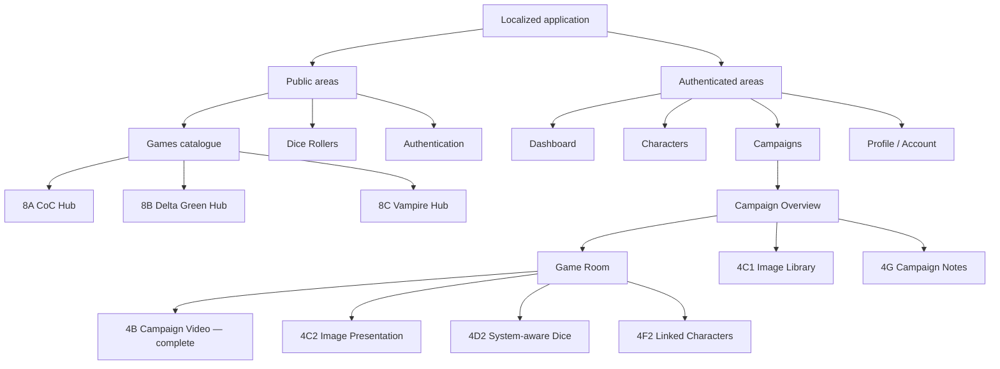

# TTRPG Hub — Approved Target Site Map

## Document boundary

This map contains only the current application and approved roadmap direction. It does not reserve routes for backlog ideas or broad campaign modules that have not been accepted.

## Access model

- Public users can access localized landing, Games, Dice Rollers, and authentication entry points.
- Authenticated users can access Dashboard, Profile/Account, owned Characters, and authorized Campaigns.
- Campaign access is derived from the immutable GM role or active Player membership.
- The Campaign Game Room and every later campaign tool reuse campaign authorization.
- Game System Hubs remain separate from private campaign workspaces.

## Target topology



## Route direction

Current routes remain authoritative in [`SITE_STRUCTURE_CURRENT.md`](SITE_STRUCTURE_CURRENT.md). Later route names should be finalized only when their phase begins.

Conceptual approved additions:

```text
/[locale]/campaigns/[id]/gallery         Current image-only Phase 4C1 route
/[locale]/campaigns/[id]/handouts        Compatibility redirect to Gallery
/[locale]/campaigns/[id]/game-room       Existing route expanded by 4C2, 4D2, 4E, and 4F2
/[locale]/campaigns/[id]/notes           Phase 4G, exact route subject to implementation review
```

CoC and Delta Green character, dice, and hub paths should follow the established game-system routing convention when those capabilities are implemented. Planned catalogue entries must not expose controls or routes before capability support exists.

## Game Room target

The approved Game Room target combines only:

- accepted campaign LiveKit video;
- GM-controlled presentation of an image selected from Campaign Gallery;
- system-aware dice appropriate to the campaign system;
- linked participant characters appropriate to the campaign system;
- technical Campaign/Game Room UX refinement.

Campaign notes may remain a Campaign area rather than a dense live-room tool unless Phase 4G usability evidence supports a narrow Game Room surface.

## Excluded target routes

The active roadmap does not approve routes for:

- standalone Video Rooms;
- general Handouts;
- NPC management;
- Sessions or Chronicle records;
- clues, maps, wikis, recording, transcription, or screen sharing.

## Later phases

Phase 5 and Phase 6 refine the existing product without inventing feature routes. Phase 7 adds Delta Green system parity. Phase 8 adds CoC, Delta Green, and Vampire hubs in that order. Phase 9 adds only public-readiness routes justified by an accepted operational requirement.
